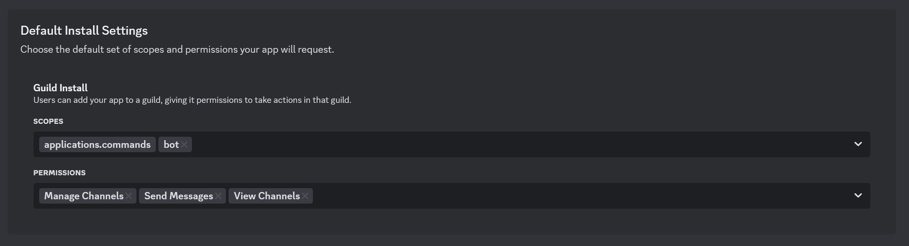

# Discord Chat Bot

Discord chat bot using AI models from [Nano-GPT.com](https://nano-gpt.com/). Supports popular AI models such as ChatGPT, Llama, Claude, Gemini, Grok, and many more!

This project isn't affiliated with [Nano-GPT.com](https://nano-gpt.com/) in anyway nor am I getting any money from any affiliate links. I'm simply using it to access many different AI models at once.

If you want more provider support open a issue!

# Privacy Notice

In order for the chat bot to remember previous messages in a conversation, the bot needs to store all messages in enabled chat channels. All stored messages are then sent to Nano-GPT.com and their respective AI model providers such as OpenAI, Google, xAI, Azure, DeepSeek, Anthropic, and so on.

- All data is stored locally in a sqlite3 database
- You must explicitly enable the bot usage in a channel
- Only messages that ping the bot or are in reply to the bot are stored
- Messages sent include the discord user's username and message content (No user IDs are sent)
- You can purge all stored messages in a channel from the bot using `/chat-purge`
- Nano-GPT does not store any conversation data on their end, however AI model providers may store them

You can verify the code that handles this is at [handler/message.go](./handler/message.go)

# Supported Models

Nano-GPT.com supports numerous models. However Discord slash commands has a limit on how many option values can be displayed at once. So by default only a handful of popular models are enabled.

You can configure this by editing the `models.yaml` file. You may add a maximum of 25 models.

You can view all available models at https://nano-gpt.com/pricing and add them below. The `Name` is the Model Name and `Value` is the API Name.

```yaml
- name: "Claude 3.7 Sonnet"
  value: "claude-3-7-sonnet-20250219"
- name: "DeepSeek V3/Deepseek Chat"
  value: "deepseek-chat"
- name: "Gemini 2.5 Pro"
  value: "gemini-2.5-pro-preview-03-25"
- name: "GPT 4.1"
  value: "openai/gpt-4.1"
- name: "GPT 4o"
  value: "gpt-4o"
- name: "Grok 3 Beta"
  value: "grok-3-beta"
- name: "Llama 3.1 8b (uncensored)"
  value: "aion-labs/aion-rp-llama-3.1-8b"
- name: "Llama 4 Maverick"
  value: "meta-llama/llama-4-maverick"
```

# Install

1. Register at https://nano-gpt.com, top up your balance, and create a API key
2. Create a new Discord App at https://discord.com/developers/applications?new_application=true
3. Copy the `Application ID` under General Information and `Token` under Bot in the settings page
4. Under the bot settings page enable Message Content Intent (This is required to listen for incoming messages to the bot)
5. Under the installation settings page enable the following Default Install Settings like below
    
    

6. Copy the `.env.example` file to `.env`
7. Fill out the `.env` file

    - `DEBUG` - Enable debug logging
    - `DISCORD_TOKEN` - Discord bot token
    - `DISCORD_APP_ID` - Discord application ID
    - `ADMIN_IDS` - List of admin user IDs separated by comma **(Make sure you add your own user ID here or you won't be able to use the bot)**
    - `NANOGPT_TOKEN` - API key from [Nano-GPT.com](https://nano-gpt.com/)
    - `MODELS_FILE` - Name of file containing available AI models
8. Build and deploy using one of the options below
9. Install the bot into one of your servers (see below)
10. Enable bot usage in server using slash command `/guild-enable`
11. Create new channel for bot usage `/chat-new`

## Docker (Recommended)

Using docker compose you can automatically build and deploy the bot

1. Create empty `database.sqlite3` file - `touch database.sqlite3`
2. Build and run container - `docker compose up -d`
3. Check container logs - `docker compose logs -f`

## Manual Binary

Build the binary and run it manually

1. Build - `CGO_ENABLED=0 go build -v -o bot cmd/bot/main.go`
2. Run - `./bot`

## Bot Install

You can view the bot install link on startup via the logs `docker compose logs -f`. 

Or you can manually construct the install link by replacing the `<application_id>` below with the `DISCORD_APP_ID` from your `.env file. 

Then go to the link in your browser and install the app. 

```
https://discord.com/oauth2/authorize?client_id=<application_id>&permissions=3088&integration_type=0&scope=bot
```

# Slash Commands

The chat bot is controlled by using slash commands. 

If you do not see slash commands after bot install, reload your Discord client.

## Admin Only

These commands can only be used by an admins specified in the `ADMIN_IDS` environment variable.

- `/balance` - Retrieves Nano-GPT balance

### Guild

Control which servers can use the bot

- `/guild-enable <!guild_id>` - Enable bot usage in guild
    - `<!guild_id>` - Optional, when missing uses current guild
- `/guild-disable <!guild_id>` - Disables bot usage in guild
    - `<!guild_id>` - Optional, when missing uses current guild
- `/guild-list` - Lists all guilds in bot config

### Blacklist

Blacklist a user from using the bot

- `/blacklist-add <user_id> <reason>` - Blacklists a user from bot usage
    - `<user_id>` - Required
    - `<reason>` - Required
- `/blacklist-remove <user_id>` - Removes user from blacklist
    - `<user_id>` - Required
- `/blacklist-list` - Lists all user from blacklist

## Guild Only

These commands can only be used inside guilds that are enabled for bot usage

- `/chat-new <model> <!prompt> <!channel>` - Creates a new chat
    - `<model>` - Required, AI model to use from `models.yaml`
    - `<!prompt>` - Optional, initial system prompt
    - `<!channel>` - Optional, use existing channel. When missing creates new channel
- `/chat-info <!channel>` - Get information about a chat
    - `<!channel>` - Optional, when missing uses current channel
- `/chat-model <model> <prompt>` - Changes the AI model in the current chat (Does not remove previous messages)
    - `<model>` - Required, AI model to use
    - `<prompt>` - Optional, initial system prompt
- `/chat-purge <!channel>` - Removes all previously stored messages from chat
    - `<!channel>` - Optional, when missing uses current channel